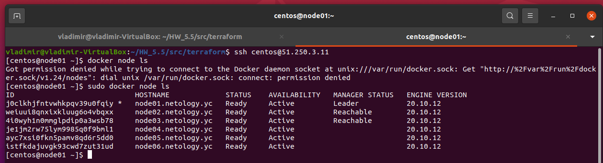
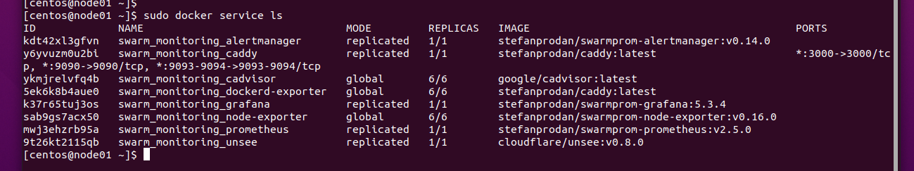
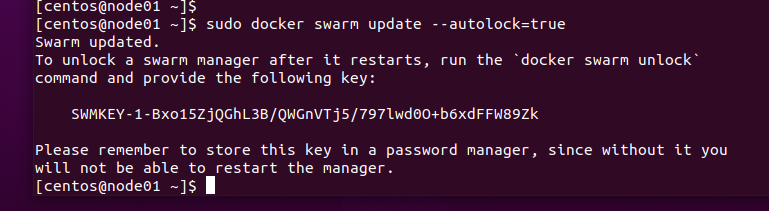

Задача 1
=

Дайте письменые ответы на следующие вопросы:

* В чём отличие режимов работы сервисов в Docker Swarm кластере: replication и global?
* Какой алгоритм выбора лидера используется в Docker Swarm кластере?
* Что такое Overlay Network?

Решение
-

1. Сервисы в режиме replication запускаются в заданном количестве. Сервисов может быть 
меньше, чем узлов. В режиме global сервисы запускаются на всех узлах в единственном 
экземпляре на всех узлах.

2. Используется алгоритм выбора лидера Raft. Если обычный узел долго не получает 
сообщений от лидера, то он переходит в состояние «кандидат» и посылает другим узлам 
запрос на голосование. Другие узлы голосуют за того кандидата, от которого они 
получили первый запрос. Если кандидат получает сообщение от лидера, то он снимает 
свою кандидатуру и возвращается в обычное состояние. Если кандидат получает 
большинство голосов, то он становится лидером. Если же он не получил большинства
(это случай, когда на кластере возникли сразу несколько кандидатов и голоса 
разделились), то кандидат ждёт случайное время и инициирует новую процедуру
голосования. Процедура голосования повторяется, пока не будет выбран лидер.

3. Overlay Network – это распределенная сеть между хостами демонов Docker, 
проложенная поверх обычной или виртуальной сети. Позволяет контейнерам обмениваться
данными при включенном шифровании.

Задача 2
=

Создать ваш первый Docker Swarm кластер в Яндекс.Облаке

Для получения зачета, вам необходимо предоставить скриншот из терминала (консоли), 
с выводом команды:

    docker node ls

Решение
-

Задача 3
=

Создать ваш первый, готовый к боевой эксплуатации кластер мониторинга, состоящий из 
стека микросервисов.

Для получения зачета, вам необходимо предоставить скриншот из терминала (консоли),
с выводом команды:

    docker service ls

Решение
-

Задача 4 (*)
=

Выполнить на лидере Docker Swarm кластера команду (указанную ниже) и дать письменное
описание её функционала, что она делает и зачем она нужна:

    # см.документацию: https://docs.docker.com/engine/swarm/swarm_manager_locking/
    docker swarm update --autolock=true

Решение
-

Команда выполнена:

Команда `docker swarm update` обновляет весь кластер с новыми значениями параметров.
В конкретном примере параметр `--autolock=true` включает автоматическую блокировку 
менеджеров кластера с помощью ключа шифрования и предоставляет этот ключ пользователю.
Закрытые ключи и данные, хранящиеся на менеджерах кластера, будут защищены этим ключом.
Без ввода этого ключа менеджеры не смогут самостоятельно перезапуститься при 
необходимости, так как без него нельзя расшифровать TLS-ключ и данные журналов Raft,
которые передаются на каждую управляющую ноду. Сделано это для защиты от 
злоумышленников, пытающихся получить доступ к конфигурации и данным кластера.