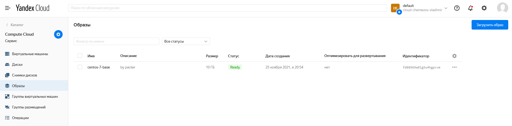
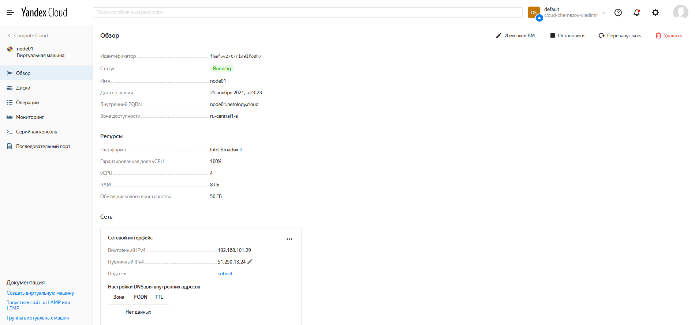
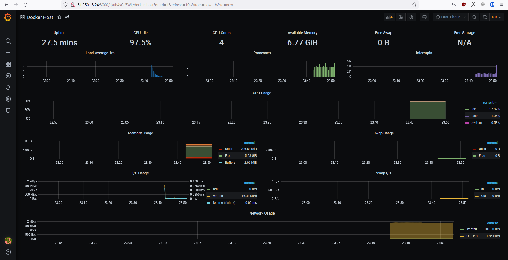
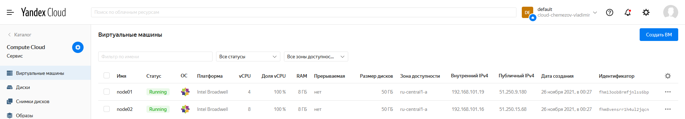
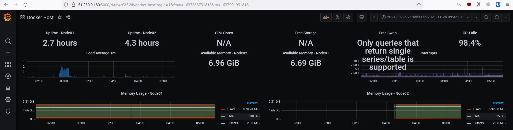

Задача 1
==
Создать собственный образ операционной системы с помощью Packer.

Для получения зачета, вам необходимо предоставить:
- Скриншот страницы, как на слайде из презентации (слайд 37).

Решение
--

Задача 2
==
Создать вашу первую виртуальную машину в Яндекс.Облаке.

Для получения зачета, вам необходимо предоставить:
- Скриншот страницы свойств созданной ВМ, как на примере ниже:

Решение
--

Задача 3
==
Создать ваш первый готовый к боевой эксплуатации компонент мониторинга, состоящий из
стека микросервисов.

Для получения зачета, вам необходимо предоставить:
- Скриншот работающего веб-интерфейса Grafana с текущими метриками, как на примере 
ниже

Решение
--

Задача 4 (*)
==

Создать вторую ВМ и подключить её к мониторингу развёрнутому на первом сервере.

Для получения зачета, вам необходимо предоставить:
- Скриншот из Grafana, на котором будут отображаться метрики добавленного вами сервера.

Решение
--
В момент запуска второй ВМ из-за ошибки в файле node02.tf (забыл исправить имя 
boot_disk на root-node02) произошел сбой запуска, и первую ВМ Я.Облако удалило. 
Нашел, исправил ошибку, но IP-адрес был изменен. Скрин 2 работающих машин ниже:

Метрики с обеих ВМ:
